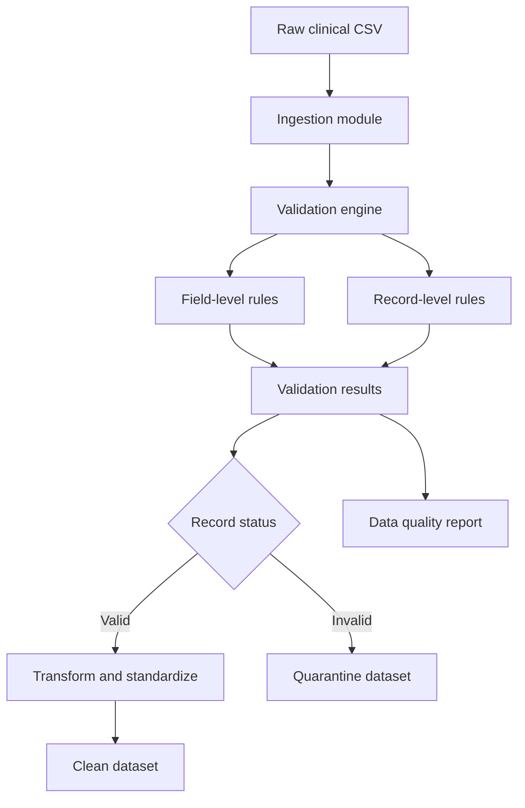

# Clinical Intelligence Platform V1 — Application Architecture
## Purpose
Version 1 is a batch-oriented data quality engine that converts raw clinical CSV data into validated, standardized, and analysis-ready outputs.
The architecture separates data ingestion, validation, transformation, reporting, and export so each component can be tested and extended independently.
## Version 1 Scope
Version 1 includes:
- CSV ingestion
- File and schema validation
- Field-level validation
- Record-level validation
- Reusable clinical validation rules
- Data standardization
- Invalid-record quarantine
- Data quality reporting
- Configurable CSV exports
- Automated testing

Interactive dashboards, PostgreSQL, APIs, RAG, authentication, and deployment are deferred to later versions.
## Architecture Diagram

## Data Flow
1. A raw clinical CSV file enters through the ingestion module.
2. The ingestion module verifies the path, file type, readability, and expected structure.
3. The validation engine applies field-level and record-level rules.
4. Validation failures are returned as structured, descriptive results.
5. Invalid records are preserved in a separate quarantine dataset.
6. Valid records are standardized and enriched.
7. The export module writes the clean dataset without modifying the original source.
8. The reporting module summarizes validation errors, missingness, and overall data quality.
9. Clean outputs may optionally be loaded into SQLite for local analytics.
## Target Repository Structure
```text
clinical-intelligence-platform/
├── data/
│   ├── raw/
│   ├── processed/
│   └── errors/
├── database/
├── docs/
│   ├── architecture.md
│   ├── data_dictionary.md
│   ├── data_risk_review.md
│   ├── validation_rules.md
│   └── data_lineage.md
├── outputs/
├── sql/
├── src/
│   ├── ingest.py
│   ├── validation_rules.py
│   ├── field_validation.py
│   ├── record_validation.py
│   ├── transform.py
│   ├── reporting.py
│   ├── export.py
│   ├── pipeline.py
│   ├── load_sqlite.py
│   ├── query_database.py
│   └── create_chart.py
├── tests/
├── README.md
└── requirements.txt
```
## Module Responsibilities
| Module | Responsibility |
|---|---|
| `ingest.py` | Load CSV files and handle invalid paths, formats, and malformed input |
| `validation_rules.py` | Provide a single maintainable source for clinical business rules |
| `field_validation.py` | Validate required fields, data types, ranges, and permitted values |
| `record_validation.py` | Detect duplicates, impossible dates, terminology problems, and cross-field inconsistencies |
| `transform.py` | Standardize and enrich records that pass validation |
| `reporting.py` | Calculate data quality metrics and generate validation reports |
| `export.py` | Export clean and quarantined datasets to configurable locations |
| `pipeline.py` | Coordinate the complete ingestion-to-export workflow |
| `load_sqlite.py` | Optionally load validated data into the local SQLite database |
| `query_database.py` | Produce supporting SQL-based analytics |
| `create_chart.py` | Produce supporting visual analytics |
## Architectural Decisions
### Batch-Oriented Processing
Version 1 uses a local batch pipeline because its primary purpose is reliable data preparation. APIs and interactive interfaces will be introduced in later versions.
### Pandas DataFrames
Pandas DataFrames are the shared in-memory format between pipeline modules. This supports transparent transformations and straightforward automated testing.
### Immutable Raw Data
Files in `data/raw/` are treated as source records and must never be overwritten. Clean and invalid records are written to separate locations.
### Single Source of Validation Rules
Clinical rules must be defined once and reused throughout the pipeline. Transformation and export modules must not duplicate validation logic.
### Structured Validation Results
Each validation failure should identify:
- The affected record
- The affected field, when applicable
- The failed rule
- The severity
- A descriptive error message
### Separation of Responsibilities
File access, validation, transformation, reporting, and export remain separate. This prevents changes to one pipeline stage from unnecessarily affecting the others.
### Configurable Paths
Input and output paths will be supplied to functions or the pipeline entry point rather than permanently hard-coded.
### Testable Functions
Core functions will accept explicit inputs and return results without depending on interactive input or hidden global state.
### Data Protection
Only synthetic, de-identified, or otherwise authorized data may be committed to the public repository. Protected health information must never be included.
## Version Boundaries
The optional SQLite and charting utilities are supporting capabilities rather than required components of the Version 1 data quality workflow.
Version 2 will build an analytics platform using validated Version 1 outputs. Versions 3 and 4 will add knowledge retrieval, AI assistance, APIs, security, monitoring, and deployment.
